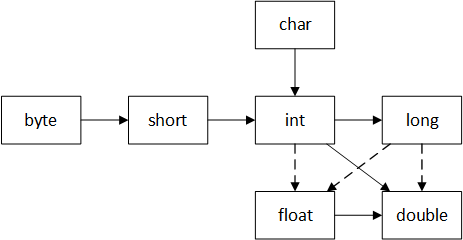
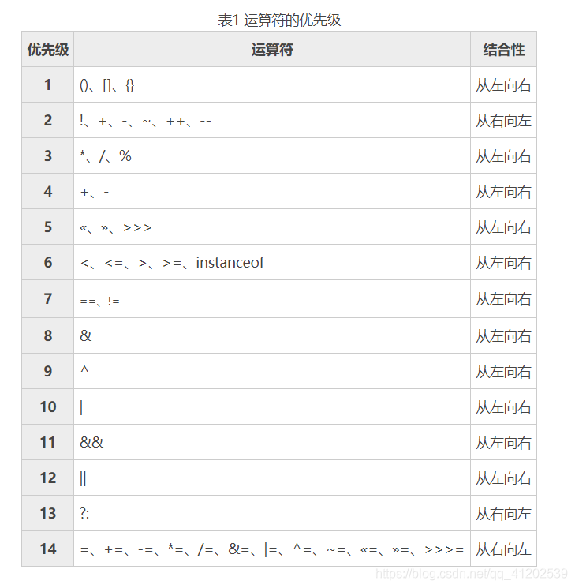
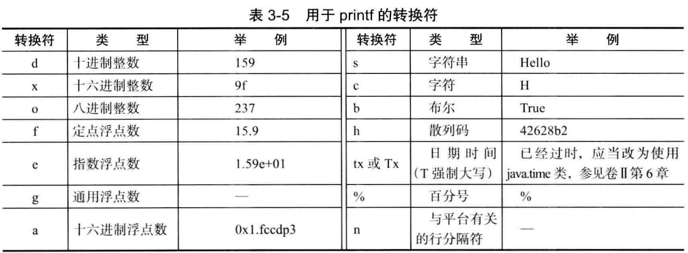

# Java基础学习

## 3.Java的基本程序设计结构

### 3.1.一个简单的Java应用程序

```java
public class Sample {
    public static void main(String[] args) {
        System.out.println("Hello world");
    }
}
```

### 3.2.注释

```java
// 单行注释
/*
	段落注释
*/
/**
 * 文档注释
/*
```

### 3.3.数据类型

#### 3.3.1.整形

| 类型  | 存储空间 | 取值范围                 |
| :---: | :------: | ------------------------ |
|  int  |  4 Byte  | $-2^{31}$ ~ $2^{31}-1$   |
| short |  2 Byte  | $-2^{10}$ ~ $2^{10} - 1$ |
| long  |  8 Byte  | $-2^{64}$ ~ $2^{64} - 1$ |
| byte  |  1 Byte  | $- 2^8$ ~  $2^8 -1$      |

- `long` 长整型后需要后缀`L`或`l`,例 `   100L`
- 十六进制数有前缀`0x`或`0X`
- 八进制数有前缀`0`
- 二进制数有前缀`0b`或`0B`
- 数字字面量可以加下划线更易读, 例如 `int i = 1_0000`是正确的。

#### 3.3.2.浮点类型

|  类型  | 存储空间 | 取值范围                                               |
| :----: | :------: | ------------------------------------------------------ |
| float  |  4 字节  | $\pm 3.402 823 47E + 38F $ (有效位数为6 ~ 7位)         |
| double |  8 字节  | $\pm 1.797 693 134 862 315 70E + 308$ (有效位数为15位) |

- float类型有后缀`F`或`f`
- double类型后缀`D`或`d`，没有后缀的浮点数值默认位double类型。
- 所有的浮点数值计算都遵循 IEEE754 规范。表示溢出和出错的三个特殊的浮点数值
  - 正无穷大
  - 负无穷大
  - NaN（不是一个数字）

#### 3.3.3.char类型

`char`类型原本用来表示单个字符。不过，现在 Unicode 字符有些可以用一个 `char` 类型表示，有些则需要两个。`char`类型需要用单引号包裹。

特殊的一些转义字符

| 转义序列 |  名称  | Unicode值 |
| :------: | :----: | :-------: |
|    \b    |  退格  |  \u0008   |
|    \t    |  制表  |  \u0008   |
|    \n    |  换行  |  \u000a   |
|    \r    |  回车  |  \u000d   |
|   \\"    | 双引号 |  \u0022   |
|   \\'    | 单引号 |  \u0027   |
|   \\\    | 反斜杠 |  \u005c   |

#### 3.3.4.Unicode 和 char 类型

#### 3.3.5.boolean 类型

`boolean` (布尔) 类型有两个值：`true`  和  `false` ，用来判断逻辑条件，整数值和布尔值之间不能相互进行转换。

### 3.4.变量

#### 3.4.1.变量声明和初始化

```java
int i;
i = 5;
int x = 5;
```

#### 3.4.2.常量

常量关键字 `final` 修饰。关键字`final`表示这个变量只能被赋值一次。习惯上常量名使用全大写。

```java
final int CODE = 5;
CODE = 7; // 尝试修改 会报错
```

类常量（静态常量）：定义在方法的外部。

```java
static final int CODE = 5；
```

### 3.5.运算符

`+`，`-`，`*`，`/`，`%`  表示加、减、乘、除、模（求余）运算。

#### 3.5.1.常用的数学函数

```java
//算术计算
Math.sqrt() : //计算平方根
Math.cbrt() : //计算立方根
Math.pow(a, b) : //计算a的b次方
Math.max( a,b ) : //计算最大值
Math.min( a,b ) : //计算最小值
Math.abs() : //取绝对值
//进位运算
Math.ceil(): //天花板的意思，就是逢余进一
Math.floor() : //地板的意思，就是逢余舍一
Math.rint(): //四舍五入，返回double值。注意.5的时候会取偶数
Math.round(): //四舍五入，float时返回int值，double时返回long值
//随机数
Math.random(): //取得一个[0, 1)范围内的随机数
```

#### 3.5.2.数值类型之间的转换



- 实线表示没有信息丢失的转换，虚线表示可能有精度损失的转换。
- 计算时，数值会自动从小存储容量类型向大存储容量类型转换。
- 如果两个操作数有一个是`double`类型，另一个操作数就会转换为`double`类型。
- 否则，如果其中有一个是`float`类型，另一个操作数会转换为`float`类型。
- 否则，如果其中有一个是`long`类型，另一个操作数会转换为`long`类型。
- 否则，两个操作数都将被转换为`int`类型；

#### 3.5.3.强制类型转换

语法格式

```java
double i = 3.33;
int x = (int) i; // x为3
```

> 强制类型转换，有可能会丢失一些信息。

#### 3.5.4.结合赋值和运算符

语法格式

```java
int x = 5;
x += 2; // 现在x的值为7  等价于 x = x + 2;
x += 3.5; // 现在x的值为10.5；  等价于 x = (double)(x + 3.5)
```

> 二元运算符会隐性的强制转换

#### 3.5.5.自增与自减运算符

前缀形式会先完成加1，而后缀形式会使用变量原来的值。

> 建议不要在表达式中使用++，容易让人困惑，产生bug

#### 3.5.6.关系和boolean运算符

关系：`==`、`!=`、`<`、`>`、`<=`、`>=`

逻辑：`&&`（与）、`||`（或）、`!`（非）

> && 和 || 是按照“短路”的方法来求值的，如果第一个操作数已经能够确定表达式的值，第二个操作数就不必计算

Java的三元运算符

```java
a = a > 0 ?  1 : 2  // 如果 a > 0 , a = 1,否则 a = 2
```

#### 3.5.7.位运算符

处理整数类型时，可以直接使用位运算来完成操作。

位运算符：`&`（按位与）、`|`（按位或）、`^`（异或）、`~`（非）

左移运算符：`<<`  

```java
x << 2; // 相当于x * 2
```

右移运算符：`>>`

```java
x >> 2; // 相当于 x / 2
```

无符号右移：`>>>`,忽略符号位，空位都以0补齐

> 移位运算符的右操作数要完成模32的运算（除非左操作数是long， long的话要模64）

#### 3.5.8.括号与运算符级别



#### 3.5.9.枚举类型

定义：

```java
enum Size {
    SMALL,
    MEDIUM,
    LARGE
}
Size e = Size.SMALL;
```

Size类型的变量只能为枚举中的值。

### 3.6.字符串

字符串声明：

```java
String str = "hello,world";
```

#### 3.6.1.子串

```
String str = "hello,world";
String s = str.substring(0, 3); // 从下标 0 到 下标 3前一位 返回hel
```

#### 3.6.2.拼接

Java语言允许使用`+`来连接两个字符串。

```java
String a = "abc";
String b = "123";
String c = a + b; // c的值为 abc123
```

#### 3.6.3.不可变性

字符串底层是用`final`修饰的`char[]`，所以String对象不可变。

#### 3.6.4.检测字符串是否相等 equals

```java
String a = "hello";
String b = "hello";
a.equals(b);  // true
```

equals方法来检测两个字符串是否相等。如果相等返回`true`，否则返回`false`。

#### 3.6.5.空串与Null串

`“”`空串是长度为0的字符串

```java
String str = ""; 
str.length();  // 空串的长度 为 0
```

检测空串

```java
if (str.equals("")) {}
if (str.length() == 0) {}
```

null表示目前没有任何对象与该变量关联

```java
String str = null
```

Null串检测

```
if (str == null) {}
```

检测既不是空串也不是null串

```java
if (str != null && str.length() != 0) {

}
```

#### 3.6.6.码点与代码单元

略

#### 3.6.7.String API

- [点击跳转](StringAPI.md)

#### 3.6.8.构建字符串

字串串链接效率比较低，每次连接字符串都会构建一个新的String对象，及耗费时间，又浪费空间。

使用`StringBuilder`类来构建字符串，

```java
StringBuilder stringBuilder = new StringBuilder()
                .append("hello")
                .append(",")
                .append("world")
                .append("!");
String str = stringBuilder.toString();
```

`StringBuffer`和·`StringBuilder`的区别：

- StringBuilder线程不安全，执行速度慢
- StringBuffer线程安全，执行速度快

### 3.7.输入输出

#### 3.7.1.读取输入

```java
Scanner scanner = new Scanner(System.in);
```

#### 3.7.2.格式化输出

```java
System.out.printf("hello,%s",name);
```




### 3.8.控制流程

#### 3.8.1.块作用域

块概念：用一对大括号括起来的若干条简单的Java语句。

```java
public static void main(String[] args) {
    int n;
    // ....
    {
        int k;
    }
}
```

不能再嵌套的两个块中声明同名的变量。

#### 3.8.2.条件语句

```java
if (i > 2) {
    // xxxxx
	System.out.println("i > 2");
} else {
    
}
```

当`i>2`时执行代码块中的语句。否则执行 else中的语句

#### 3.8.3.循环

当条件为`true`时，while循环执行。

```java
while (条件) {
	// 循环语句
}
```

> 如果开始时循环条件为`false`，那么`while`循环体一次也不执行